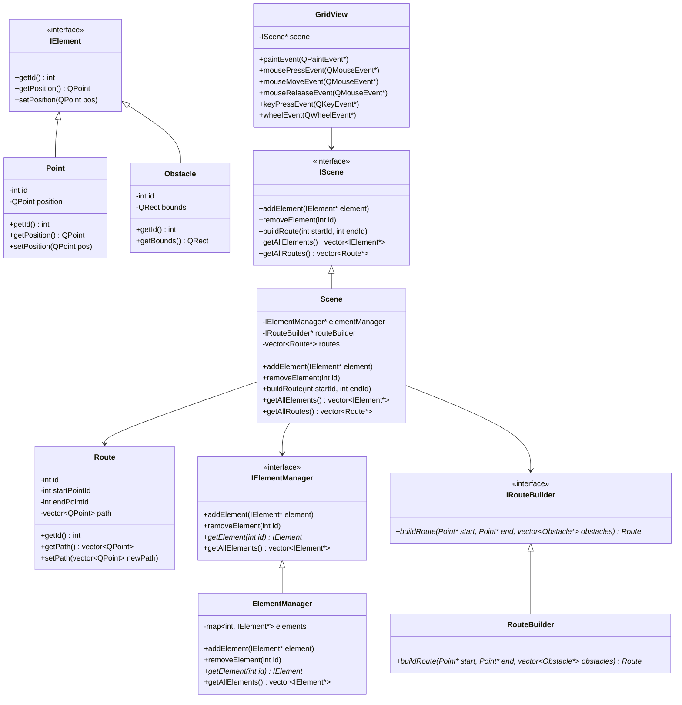

# Архитектура приложения Grid View

## Обзор

Приложение Grid View было рефакторинговано в соответствии с принципами SOLID для улучшения модульности, тестируемости и расширяемости кода.

## Принципы SOLID

### 1. Single Responsibility Principle (Принцип единственной ответственности)
Каждый класс имеет одну причину для изменения:
- `Point` - представляет точку на сцене
- `Obstacle` - представляет препятствие на сцене
- `Route` - представляет маршрут между точками
- `ElementManager` - управляет элементами сцены
- `RouteBuilder` - строит маршруты между точками
- `Scene` - координирует все элементы сцены
- `GridView` - отвечает за отображение и обработку пользовательского ввода

### 2. Open/Closed Principle (Принцип открытости/закрытости)
Классы открыты для расширения, но закрыты для модификации:
- Новые типы элементов могут быть добавлены через наследование от `IElement`
- Новые алгоритмы маршрутизации могут быть добавлены через реализацию `IRouteBuilder`

### 3. Liskov Substitution Principle (Принцип подстановки Барбары Лисков)
Все реализации интерфейсов могут заменять базовые типы без нарушения функциональности.

### 4. Interface Segregation Principle (Принцип разделения интерфейса)
Вместо одного толстого интерфейса используются несколько маленьких специализированных:
- `IElement` - для всех элементов сцены
- `IElementManager` - для управления элементами
- `IRouteBuilder` - для построения маршрутов
- `IScene` - для управления сценой

### 5. Dependency Inversion Principle (Принцип инверсии зависимостей)
Зависимости от абстракций, а не от реализаций:
- `Scene` зависит от `IElementManager` и `IRouteBuilder`, а не от конкретных реализаций
- `GridView` зависит от `IScene`, а не от конкретной реализации сцены

## Архитектура

### Диаграмма классов

## Структура проекта

### Директории
- `include/` - заголовочные файлы
- `src/` - файлы реализации
- `build/` - директория сборки (создается при сборке)

### Компоненты

#### include/
- `i_element.h` - базовый интерфейс для всех элементов на сцене
- `point.h` - реализация точки на сцене
- `obstacle.h` - реализация препятствия на сцене
- `route.h` - представление маршрута между двумя точками
- `i_element_manager.h` - интерфейс для управления элементами сцены
- `element_manager.h` - реализация менеджера элементов
- `i_route_builder.h` - интерфейс для построения маршрутов
- `route_builder.h` - реализация построителя маршрутов
- `i_scene.h` - интерфейс для управления сценой
- `scene.h` - реализация сцены, координирующая все элементы
- `scene_factory.h` - фабрика для создания экземпляров сцены
- `grid_view.h` - виджет Qt для отображения и обработки пользовательского ввода

#### src/
- `main.cpp` - точка входа в приложение
- `grid_view.cpp` - реализация виджета Qt
- `point.cpp` - реализация точки
- `obstacle.cpp` - реализация препятствия
- `route.cpp` - реализация маршрута
- `element_manager.cpp` - реализация менеджера элементов
- `route_builder.cpp` - реализация построителя маршрутов
- `scene.cpp` - реализация сцены
- `scene_factory.cpp` - реализация фабрики сцены

## Паттерны проектирования

### Фабрика
`SceneFactory` используется для создания экземпляров сцены.

### Композиция
`Scene` компонует различные компоненты системы.

### Делегирование
`GridView` делегирует всю бизнес-логику сцене.

## Преимущества новой архитектуры

1. **Модульность** - каждый класс имеет четко определенную ответственность
2. **Тестируемость** - компоненты могут быть протестированы изолированно
3. **Расширяемость** - новые функции могут быть добавлены без изменения существующего кода
4. **Поддерживаемость** - изменения в одном компоненте не влияют на другие
5. **Гибкость** - можно легко заменить реализации интерфейсов
6. **Стандартная структура** - четкое разделение заголовочных файлов и реализаций